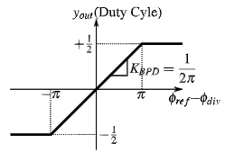
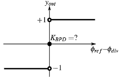
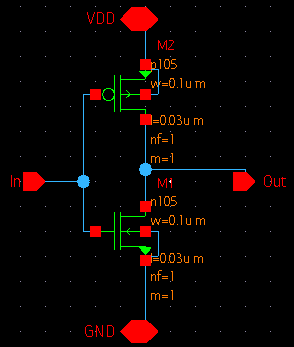
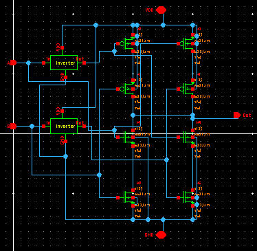
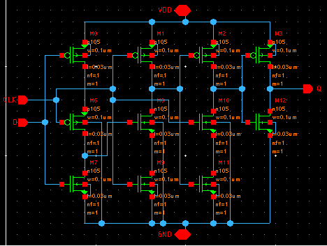
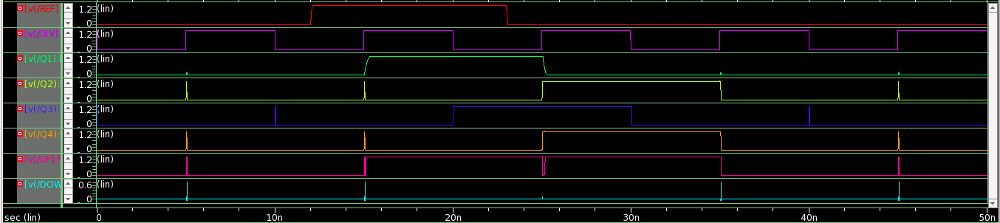
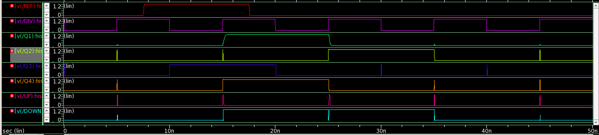

# 28nm CMOS Bang Bang Phase Detector

This repository presents the design of Bang Bang Phase detector(BBPD) using Synopsys Custom Compiler on 28nm CMOS Technology.

# Table of Contents

- [28nm CMOS Bang Bang Phase Detector](#28nm-cmos-bang-bang-phase-detector)
- [Table of Contents](#table-of-contents)
- [Introduction](#introduction)
- [Alexander phase detector](#alexander-phase-detector)
- [Tools Used](#tools-used)
- [Pre-Layout Schematics and Simulations](#pre-layout-schematics-and-simulations)
  - [Schematics](#schematics)
    - [Inverter](#inverter)
    - [Xor gate](#xor-gate)
    - [D-Flip flop](#d-flip-flop)
  - [Simulations](#simulations)
    - [Clock leads data](#clock-leads-data)
    - [Clock lags data](#clock-lags-data)
- [Netlist of the circuit](#netlist-of-the-circuit)
- [Author](#author)
- [Acknowledgements](#acknowledgements)
- [References](#references)

# Introduction

Wireless communication has become the fastest, reliable and cost efficient modes of communication across the globe. One of the important blocks of wireless communication is the phase locked loops (PLL's). PLL's are used to produce stable high frequency signals when given a low frequency reference signal, with the help of phase detector, frequency divider and a VCO as shown in fig.1.

 
    Fig.1 : Block diagram of a basic PLL

The basic operation of a phase detector is to take in two input signals(reference and clock), compare them and generate two other output signals(Up and down) and determine which one of the two input signals lead/lags the other. Depending upon the kind of application intended, there are different topologies of phase detectors. Broadly they are classified into linear and non-linear phase detectors based on the gain of the phase detector. The gain of a phase detector is given by Eq.1.

    Gain = (Dutycycle of output)/(phase difference of input)
The below figures shows the characteristics of linear and non-linear phase detectors.

 
    Fig.2(a): Linear phase detector 
 
    Fig.2(b) : Binary phase detector

# Alexander phase detector

Fig.3 shows the circuit of alexander phase detector which gives the output pulses which are proportional to the sign of the phase difference between the given input signals. Due to this binary nature of the phase detector it is termed as bang bang phase detector(BBPD). This phase detector takes the reference and divider output signals, sample them with positive and negative edge of the clock respectively and then synchronized them using flip-flops. The output of the first flip-flop (Q1) and output of the fourth flip-flop (Q4) are XOR-ed to give the UP signal, similarly the output of the second flip-flop (Q2) and flip-flop (Q4) are XOR-ed to get the DOWN signal. This phase detector is most commonly used in CDR applications where the clock and data rates are nearly equal i.e, same frequency.But in PLL's it is highly unlikely to have the initial frequencies of reference and clock to be equal.

 
    Fig.3 : Alexander phase detector

# Tools Used

<b>• Synopsys Custom Compiler:</b> 
&emsp;The Synopsys Custom Compiler™ design environment is a modern solution for full-custom analog, custom digital, and mixed-signal IC design. As the heart of the Synopsys Custom Design Platform, Custom Compiler provides design entry, simulation management and analysis, and custom layout editing features. This tool was used to design the circuit on a transistor level.

<b>• Synopsys Primewave:</b> 
&emsp;PrimeWave™ Design Environment is a comprehensive and flexible environment for simulation setup and analysis of analog, RF, mixed-signal design, custom-digital and memory designs within the Synopsys Custom Design Platform. This tool helped in various types of simulations of the above designed circuit.

<b>• Synopsys 28nm PDK:</b> 
&emsp;The Synopsys 28nm Process Design Kit(PDK) was used in creation and simulation of the above designed circuit.

# Pre-Layout Schematics and Simulations

## Schematics

### Inverter

 
    Fig.4 : Inverter

### Xor gate

 
    Fig.5 : Xor gate

### D-Flip flop

The D-flip-flops used for designing phase detector is based on true single phase clock(TSPC) logic as shown in fig.6. We opt for this topology over the other because of the advantage of its reliability in high frequency applications and lesser power consumption.

 
    Fig.6 : TSPC logic based D-fipflop

## Simulations

After creating and saving the schematic go to 'Tools' and open 'Primewave' to start the simulation. In the Primewave select the 'model file' i.e the '28nm PDK's .lib file presentin the HSPICE folder. After this select the 'tran' analysis in the analysis window and give the 'Start', 'Stop', and 'Step Size' parameters and save it. Then add the outputs which needs to be plotted by selecting the nets on the schematic. 
One other thing we need to keep in mind is that here we have loop for which an initial condition needs to be declared. For that, we have to go to 'Setup -> Convergance aids' and select the net for which we want to set an initial condition.Then go to 'Simulations -> Netlist and Run' to generate a netlist and run the simulation to get the below output.

### Clock leads data

The input clock signal leads the data signal which makes the output signal UP to go high and the DOWN to go low as shown in fig.7

 
    Fig.7 : Output waveforms of Alexander phase detector when the input clock signal leads the clock signals.

### Clock lags data

The input clock signal lags the data signal which makes the output signal UP to go high and the DOWN to go low as shown in fig.8

 
    Fig.8 : Output waveforms of Alexander phase detector when the input clock signal leads the clock signals.

# Netlist of the circuit

Refer to the netlist of the Alexander phase detector here:  <a href = 'bbpd.sim'>Netlist</a>

# Author

- Sresthavadhani Mantha, B.Tech(ECE), International Institute of Information Technology, Hyderabad

# Acknowledgements

- <a href='https://www.iith.ac.in/events/2022/02/15/Cloud-Based-Analog-IC-Design-Hackathon/'>Cloud Based Analog IC Design Hackathon</a> 

- <a href='https://www.synopsys.com/'>Synopsys India</a> 
- <a href='https://www.vlsisystemdesign.com/'>VLSI System Design (VSD) Corp. Pvt. Ltd India</a> 

# References

[1] C. Sánchez-Azqueta, C. Gimeno, C. Aldea, S. Celma and C. Azcona, "Bang-bang phase detector model revisited," 2013 IEEE International Symposium on Circuits and Systems (ISCAS), 2013, pp. 1761-1764, doi: 10.1109/ISCAS.2013.6572206. 
[2] H.  Xu  and  A.  A.  Abidi,  “Design  methodology  for  phase-locked  loops  using  binary  (bang-bang)phase detectors,”IEEE Transactions on Circuits and Systems I: Regular Papers, vol. 64, no. 7, pp.1637–1650, 2017
